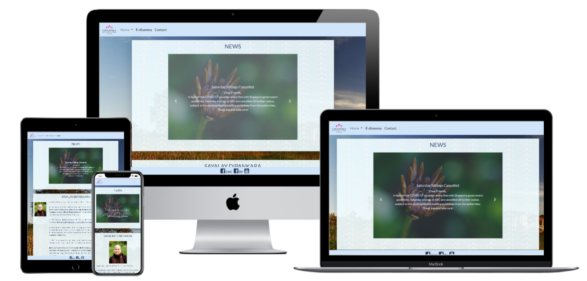
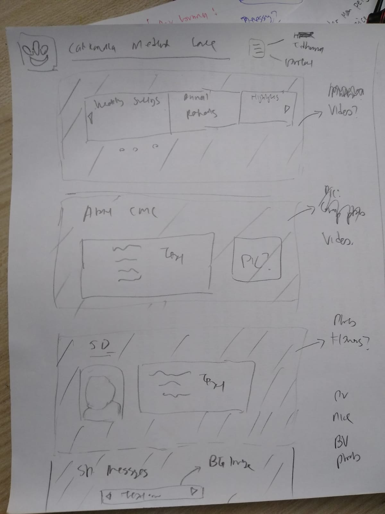
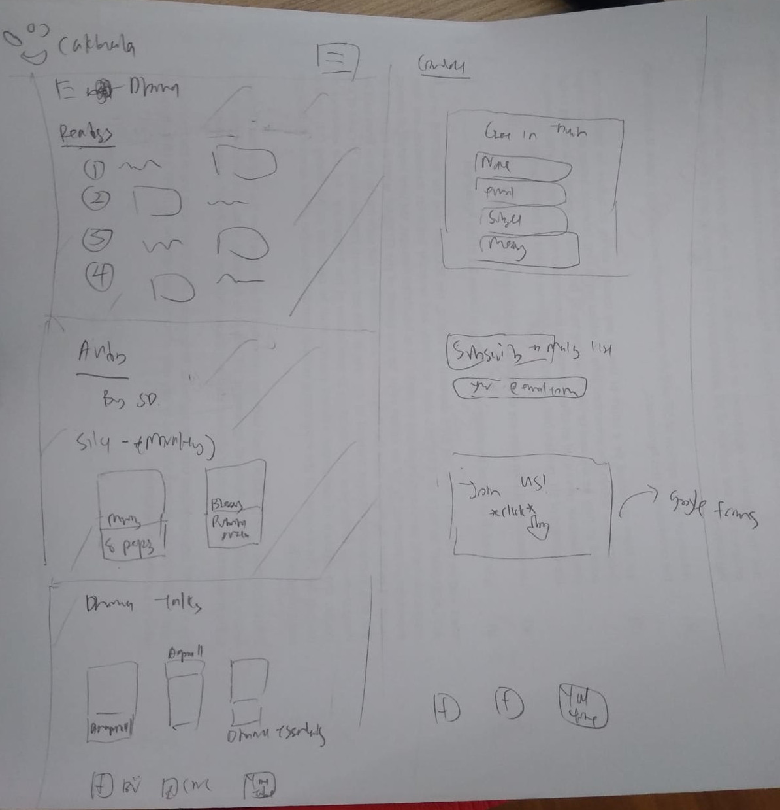
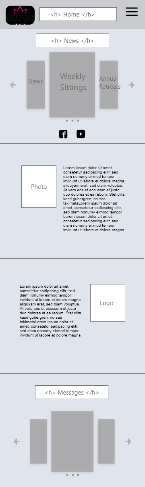
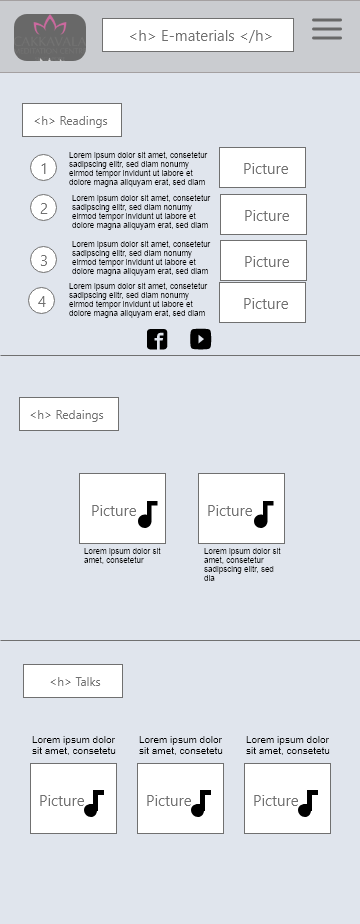
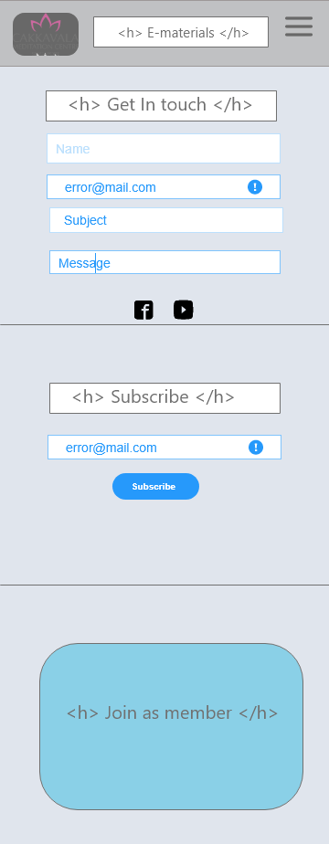

# Project Title: Revamp of Cakkavala Meditation Centre Website

## 1. Overview
The society "Cakkavala Meditation Centre" was set up in 2000. Thereafter it set up a website with the primary purpose of: 
- Disseminating news and information of activities
- Sharing resources on the practice of meditation
- Providing a channel to contact the society

The website's layout (link [here](http://www.cakkavala.org/index.htm)) has not changed since it was set up in 2000. 

### Problem statement
New sections and pages were added as and when needed over time. As a result, the website gradually became disorganised and un-intuitive, with having to click on various pages to search for what they need. The site owner has additionally expressed the wish to improve the site by making it mobile responsive.  

### Objective
This project is an effort to revamp the original website, such that its layout is simple and conducive for viewing of information and accessing online resources. The next objective is to make the site mobile responsive.

### Demo of Revamped Site
A live demo of the revamped website can be accessed here: https://4forces.github.io/project1/

## 2. UX, UI and Features

### Wireframes
Initial wireframing was done via hand-sketches on paper. This was subsequently digitised by porting over to Adobe XD.

*Figure (a): Wireframes by Hand-sketching*

  

*Figure (b): Wireframes by Adobe XD*

  

### Appearance
The new site has a similar color theme with the original website, which is light-blue. Blue tones are related to stability, peace and calmness - the qualities of meditation.  

### Features and Pages
The following points were kept in mind in the design of the website: 
1. Organised
2. Simple look and feel
3. Ease of navigation

__a) Home Page__
Upon visiting the site, the first page visitors see shows the updates of recent activities. This is inline with one of the site's primary purpose, which is to inform and update on upcoming activities. After which is an introduction of the background of the meditation teacher and the society.  

__b) E-dhamma Page__
This page serves as a central repository for the various online resources. The resource materials were scattered, and at times duplicated on various pages on the original site. 

__c) Contact Page__
The contact page has a form element designed to receive enquiries and messages from visitors. It is hoped that this feature will provide some convenience to visitors making enquiries. The original site does not have this feature. An email address is also provided in the event visitors still wish to contact the society directly. 

### Target Audience
The main visitors to the website will be those who are interested in updates on the weekly group meditation sittings and to-be conducted meditation retreats. The second group of visitors are those who may be looking for resources related to the practice of meditation. 

### Future Improvements
1. To incorporate a form of database to capture forms data at the contact page.
2. To include a message box to indicate successful form submission at the contact page. 
3. To incorporate a form element for members registration. Either locally, or an external site like Google forms. 

## 3. Technologies Used
The following technologies were used in the construction of this website:
1. [Bootstrap v4.0](https://getbootstrap.com/)
2. HTML
3. CSS
4. JavaScript

## 4. Testing

Site responsiveness was tested on: 
- Firefox 
- Google Chrome
- Microsoft Edge
- iPhone 6/7/8
- iPhone X
- Moto G7
- Oppo R11

__Checks performed__

1. W3C Validator - Link [here](https://validator.w3.org/nu/?doc=https%3A%2F%2F4forces.github.io%2Fproject1%2F)
2. CSS Jigsaw Validator - Link [here](https://jigsaw.w3.org/css-validator/validator?uri=https%3A%2F%2F4forces.github.io%2Fproject1%2F&profile=css3svg&usermedium=all&warning=1&vextwarning=&lang=en)
3. Images do not appear distorted
4. Site elements display as intended
5. Internal and external links are working/not broken

__Bugs discovered__
1. On the homepage, when the carousel arrow is clicked, the page moves up and the "News" header is covered.  
2. On Microsoft Edge, footer background colour disappears. 

## 5. Credits

__HTML and CSS Tips:__
1. [W3Schools.com](https://www.w3schools.com/)

__Images:__
1. [Cakkavala Facebook page](https://www.facebook.com/cakkavala)
2. [Brahmavihari Meditation Centre Facebook page](https://www.facebook.com/brahmavihari/)
3. [Unplash](https://unsplash.com/)
4. [Pexels](https://www.pexels.com/)
5. [CC Search](https://ccsearch.creativecommons.org/)

__Fonts and Icons:__
1. [Google Fonts](https://fonts.google.com/)
2. [Font Awesome 4](https://fontawesome.com/v4.7.0/)
3. [Favicon.io](https://favicon.io/favicon-converter/)

__Scripts:__
1. [Bootstrap v4.0](https://getbootstrap.com/)
2. [Smooth scrolling effect](https://www.w3schools.com/howto/howto_css_smooth_scroll.asp)
